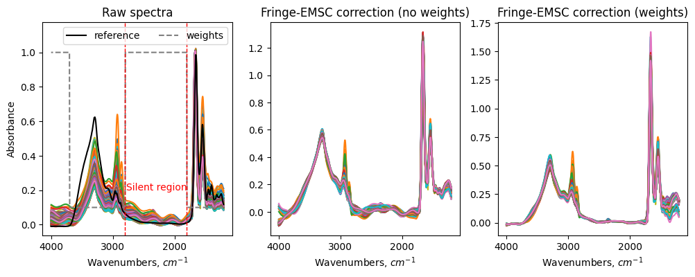
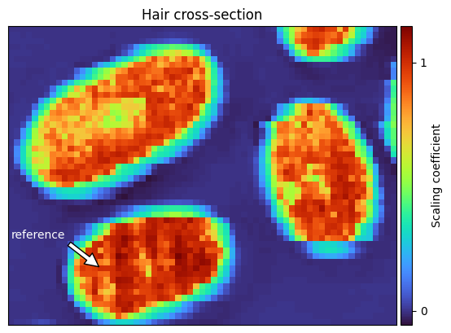

Spectra preprocessing
=========================================

Before infrared absorbance spectra are analyzed, common practice is to
preprocess the spectra. In this tutorial, we will show how to use the
biospectools package to preprocess spectra in different cases.

.. note::

    The tutorial is under development. If you found a mistake or want to suggest
    an improvement, please, consider to
    `create an issue <https://github.com/BioSpecNorway/biospectools/issues/new>`_
    on GitHub or write to the email uladzislau.blazhko@nmbu.no.

.. contents::

.. _tutorials standard emsc:

Standard spectral correction (EMSC)
-----------------------------------

Often measured spectra have only simple scattering effects such as baseline
offset, linear, and quadratic effects. Also due to variation in sample
thickness one may see multiplicative effects in spectra that often require
normalization. In this case, the standard Extended Multiplicative Scattering
Correction (EMSC) method (using second polynomial order,
see :ref:`section above<tutorials emsc framework>`) [Mart91]_
can be used to remove the baseline variations and normalize spectra.

>>> from biospectools import EMSC
>>> reference_spectrum = raw_spectra.mean(axis=0)
>>> emsc = EMSC(reference_spectrum, wavenumbers)
>>> corrected_spectra = emsc.transform(raw_spectra)

.. _tutorials emsc framework:

EMSC Framework
--------------

The EMSC method [Mart91]_ is used to remove unwanted variation in spectra. First, it
decomposes the spectrum into given components. One of the components must always
be a reference spectrum, while other components usually model variations in
raw spectra that need to be removed. Using the least squares method, EMSC
estimates the contribution of each given component. After the contribution of
each component is known, it reconstructs a spectrum using only
relevant components, while excluding unwanted components.

For example, the basic model described in the :ref:`section above<tutorials standard emsc>`
includes a reference spectrum, baseline, linear and quadratic components
denoted below in bold as :math:`\mathbf{reference}`, :math:`\mathbf{1}`,
:math:`\mathbf{\tilde{\nu}}`, :math:`\mathbf{\tilde{\nu}^2}`, respectively.
Their contributions are denoted as coefficients :math:`b`, :math:`a`, :math:`c`,
:math:`d`. The residual term :math:`e(\tilde{\nu})` denotes all variation in
the spectrum that could not be represented with the given components. Thus,
from the formula below we see that the corrected spectrum is equals the raw
spectrum but without contibution of the baseline offset, and the linear and
quadratic components. In other words, the corrected spectrum is a reference
spectrum plus variation that did not fit any other component normalized by a
scaling coefficient :math:`b`.

.. math::

    spectrum(\tilde{\nu}) &= b*\mathbf{reference(\tilde{\nu})} + a*\mathbf{1} + c*\mathbf{\tilde{\nu}} + d*\mathbf{\tilde{\nu}^2} + е(\tilde{\nu}) \\
    corrected(\tilde{\nu}) &= \mathbf{reference(\tilde{\nu})} + \frac{e(\tilde{\nu})}{b}

The `EMSC` class has a parameter ``poly_order=2`` that gives the highest order
of the polynomial terms used in the model. The parameter can be changed, for example, to
``poly_order=3``, then it will also add a cubic component (:math:`\tilde{\nu}^3`).
Using higher-order polynomials in EMSC may help to model more sophisticated
scattering. However, too big polynomial order will make the
model so versatile that it may start to remove chemical information from
a spectrum, e. g. remove peaks. So it is always a tradeoff between removing
scattering features and leaving chemical information. As a consensus, a
default value ``poly_order=2`` is often used for mid infrared absorbance
spectra. For Raman spectra, the polynomial order can be significantly higher [Afse12]_

In the following sections, we will show how the EMSC model can be further
extended to perform spectra correction in more sophisticated cases.

Removing irrelevant chemical components (EMSC)
----------------------------------------------

In some cases, a sample may contain unwanted chemical components. For
example, biological samples may have a varying degree of water content due to
variations in the humidity. Further, tissue sections are often embedded in
paraffin, which leaves signals from paraffin in the absorbance spectra. In
those cases, the contribution given by interferent components is irrelevant
for the subsequent analysis. It can be removed by the EMSC model extended
with a spectrum of unwanted chemical component [Solh22]_ [Afse12]_.

A list of unwanted chemical components can be passed to the `EMSC` model through
`interferents` parameter. Then during preprocessing, EMSC will remove those
interferents from spectra.

>>> from biospectools import EMSC
>>> reference_spectrum = raw_spectra.mean(axis=0)
>>> emsc = EMSC(reference_spectrum, wavenumbers, interferents=[paraffin])
>>> corrected_spectra = emsc.transform(raw_spectra)

Fringe correction (Fringe-EMSC)
-------------------------------

Samples in the shape of thin film (e. g. waxed tissue section, sample slices)
, may have sine-like baseline distortions in spectra, commonly referred to as
fringes. Fringes can be removed automatically by the Fringe-EMSC algorithm
[Solh21]_. For the estimation of fringe parameters, the algorithm requires a
wavenumber range of a chemically silent region (usually 1800-2800 cm-1),
where the fringes are most clearly pronounced.

The example below shows spectra of hair cross-sections [Sand21]_. Hair
cross-sections have a thin-film shape, so we see fringes in the spectra. To
remove them we used Fringe-EMSC. As a reference spectrum we took a spectrum
of matrigel, which is not exactly representative for the hair spectra.
Therefore in addition to standard parameters, here we used feature weights. The
weights are used to tell the EMSC model to pay more or less attention
to some regions of the spectra [Solh22]_. In this particular case, we
decreased the weights of the absorbance regions to allow bigger fitting error
in those regions (since the reference spectrum is not very well fitting),
while allowing less fitting error in the fringes region. Without weighting,
the discrepancies between the reference spectrum and the raw spectra in
chemically active regions would drag away the sine-components from fitting
fringes well.

>>> from biospectools import FringeEMSC
>>> reference = matrigel
>>> weights = np.full_like(wns, 0.1)
>>> weights[(wns > 1800) & (wns < 2800) | (wns > 3700)] = 1
>>> #
>>> femsc = FringeEMSC(
>>>     reference, wns, fringe_wn_location=(1800, 2800), weights=weights)
>>> corrected = femsc.transform(raw_spectra)

Mie scattering correction
-------------------------

Mie-type scattering often occurs in infrared microspectroscopy, where
measured samples are of micrometer size [Mohl05]_. At this scale, an infrared
spectrum is not only affected by the chemical properties of a sample but also
its morphological features like size and shape. Usually, Mie scattering
appears as a broad wave in the spectrum accompanied by deepenes near the base
of peaks. Sometimes, Mie scattering may affect the measured spectrum so
strongly that its usual peaks get reversed, and the absorbance spectrum
starts to remind a transmission spectrum. Mie scattering complicates the
subsequent chemical analysis of samples and usually should be removed by
preprocessing methods.

Here is an example of a spectrum of a microplastic bead of 5.5 um diameter
(PMMA sphere) that exhibits strong Mie scattering features.

Model-based approach (ME-EMSC)
______________________________

ME-EMSC is a state-of-the-art algorithm for Mie scattering correction of
infrared transmission spectra obtained from spherical samples [Solh19]_. The
algorithm employs a Mie subspace-model, where possible scattering
realizations are computed using Mie theory. The solutions are compressed by
PCA into a subspace-model consisting of the PCA loadings. The loadings are
used as components for the EMSC model, and the scattering contribution in the
measured spectrum is thus parameterized and removed in the ME-EMSC. In order
to compute the possible scattering realizations using Mie theory, the
reference spectrum is used. It serves as input for the initial estimate of
the imaginary part of the refractive index. After the first iteration, the reference
spectrum is updated to the corrected spectrum. Iteration by iteration, the
distinct chemical features of the pure absorbance spectrum is gradually
retrieved. We refere to [Solh19_] for more details.

>>> from biospectools import MeEMSC
>>> memsc = MeEMSC(reference, wns)
>>> corrected = memsc.transform(raw_spectra)

Advanced usage
^^^^^^^^^^^^^^

For the ones, who are developing correction algorithms might be potentially
interesting to change some particular steps of the ME-EMSC algorithms. Our
implementation allows to easily change the following steps: the way how mie
curves are generated (`CustomMieCurvesGenerator`), the way how mie curves are
decomposed (`CustomMieCurvesDecomposer`) and the deicision when to stop
iteration based on the mean squared error ( `CustomStopCriterium`). To do it,
a class with a particular method must be implemented:

>>> class CustomMieCurvesGenerator:
>>>     ...
>>>     def generate(self, pure_absorbance, wavenumbers):
>>>         ...
>>>         return simulated_mie_curves
>>> #
>>> class CustomMieCurvesDecomposer:
>>>     ...
>>>     def find_orthogonal_components(self, simulated_mie_curves):
>>>         ...
>>>         return components
>>> #
>>> class CustomStopCriterion(BaseStopCriterion):
>>>     ...
>>>     def _stop(self) -> bool:
>>>         ...
>>>         return is_stop
>>> #
>>> # set custom parts of ME-EMSC algorithm
>>> memsc = MeEMSC(reference, wavenumbers)
>>> memsc.mie_generator = CustomMieCurvesGenerator(...)
>>> memsc.mie_decomposer = CustomMieCurvesDecomposer(...)
>>> memsc.stop_criterion = CustomStopCriterion(...)

Deep learning approach (DSAE)
_____________________________

While the ME-EMSC method is suitable for preprocessing of thousand spectra,
it quickly becomes inconvenient to use with hyperspectral images. There are
two main reasons for that (i) it is slow, so preprocessing of 15000 spectra
may take about 1 hour; (ii) it requires a reference spectrum which is
especially problematic for hyperspectral images. To speed up the ME-EMSC
method, a neural network that predicts ME-EMSC correction results can be
trained (Descattering Autoencoder, DSAE) [Magn20]_. It proved to
automatically select a suitable reference spectrum from those used
for ME-EMSC correction. Additionally, it removes noise from spectra.

Training
^^^^^^^^

Usually, the DSAE model needs to be trained from scratch for each new problem
. It means that first, you will need to run ME-EMSC preprocessing for some
small part of your dataset, then train the DSAE model to predict ME-EMSC
correction given raw spectra, and then the DSAE model can be applied to the
rest of the dataset.

DSAE object builds a TensorFlow model, so `TensorFlow <https://www.tensorflow.org/tutorials>`_
or `Keras <https://keras.io/examples/>`_ framework is required for training.
Here is a rough of example how this could be done:

>>> memsc = MeEMSC(reference, wavenumbers)
>>> corrected = memsc.transform(raw_spectra)
>>> # ...
>>> dsae = DSAE(wavenumbers)
>>> dsae.model.fit(x=raw_spectra, y=corrected, epochs=100)
>>> # ...
>>> dsae.transform(rest_of_the_raw_spectra, wavenumbers)

.. note::
    In case you are using a default DSAE architecture (as in example above),
    number of points in spectrum must be divisable by 64,
    i.e. ``len(wavenumbers) % 64 == 0``

Using DSAE pre-trained on filamentous fungi
^^^^^^^^^^^^^^^^^^^^^^^^^^^^^^^^^^^^^^^^^^^

At this point, there is only one available pre-trained model of DSAE that was
trained on spectra of filamentous fungi Mucor circinelloides [Magn20]_. The
example below shows preprocessing of filamentous fungi spectra by the
pre-trained DSAE model.

>>> from biospectools import DSAE
>>> dsae = DSAE.pretrained_on_fungi()
>>> corrected = dsae.transform(mucor_circinelloides_spectra, wavenumbers)

Advanced usage
^^^^^^^^^^^^^^

For the ones who familiar with deep learning, it might be interesting to
tailor architecture by setting up parameters ``filters``,
``kernel_sizes`` and ``strides`` during DSAE initialization.

Replicate correction (EMSC)
---------------------------

Sometimes spectra may contain scattering features that cannot be explained
well by polynomial components, sine-fringes, or Mie curves. In this case, we
should somehow explain to the EMSC model "wild" scattering components. We can
obtain them utilizing differences in so-called technical replicates.
Technical replicates are repeated measurements of the same sample, so the
differences in them are mainly caused by scattering. The algorithm that
utilizes technical replicates for scattering correction is called replicate
correction [Tafi21]_. Here we will briefly go through four main steps and
show how each of those can be implemented with biospectools.

1) Calculate global scaling for each spectrum in the dataset

>>> from biospectools import EMSC
>>> #
>>> # dataset is pandas DataFrame with all necessary information
>>> raw_spectra = dataset[wavenumbers].values
>>> reference = raw_spectra.mean(axis=0)
>>> emsc = EMSC(reference, wavenumbers)
>>> _, dtls = emsc.transform(raw_spectra, details=True)
>>> dataset['global_scaling'] = dtls.scaling_coefs

2) Gather variation across different groups of technical replicates:

>>> replicate_variation = []
>>> #
>>> # suppose that spectra of technical replicates has the same replicate_id
>>> # wns = wavenumbers
>>> for repl_id, tech_repls in dataset.groupby('replicate_id'):
>>>     raw_tech_repls = tech_repls[wavenumbers].values
>>>     reference = raw_tech_repls.mean(axis=0)
>>>     #
>>>     emsc = EMSC(reference, wns)
>>>     corrs, dtls = emsc.transform(raw_tech_repls, details=True)
>>>     #
>>>     variation = corrs - corrs.mean(axis=0)
>>>     global_scaling = tech_repls['global_scaling'].values[:, None]
>>>     local_scaling = dtls.scaling_coefs[:, None]
>>>     scaled = variation * local_scaling / global_scaling
>>>     replicate_variation.extend(scaled)

3) Use PCA to calclulate principal components of gathered variation

>>> from sklearn.decomposition import PCA
>>> pca = PCA()
>>> pca.fit(replicate_variation)
>>> n_components = np.sum(pca.explained_variance_ratio_.cumsum() < 0.95)
>>> scattering_components = pca.components_[:n_components]

4) Add scattering components to EMSC model as interferents

>>> reference = raw_spectra.mean(axis=0)
>>> emsc = EMSC(reference, wavenumbers, interferents=scattering_components)
>>> corrected = emsc.transform(raw_spectra)

Hyperspectral image correction
------------------------------

All the classes presented above are input-shape independent, i. e.
they can accept just one spectrum, list of spectra, or hyperspectral image.
Usually, the ``transform`` method assumes that the wavenumbers dimension is
the last one and preserves all other "spatial" dimensions.

Here is an example of preprocessing of a single spectrum and a hyperspectral
image with 128x128 pixels, where each pixel represents a spectrum with 3000
wavenumbers (points).

>>> single_spectrum    # shape (3000,)
>>> hyperspectral_img  # shape (128, 128, 3000)
>>> emsc = EMSC(reference, wavenumbers)
>>> corr_spectrum = emsc.transform(single_spectrum)  # shape (3000,)
>>> corr_img = emsc.transform(hyperspectral_img)     # shape (128, 128, 3000)

Separating sample from background
_________________________________

The estimated components' contributions bear practical information.
For example, the :ref:`scaling coefficient<tutorials emsc framework>` is
related to sample thickness. It shows how much spectrum contains the analyte
signal and, therefore, can be used for filtering low-signal spectra or sample
segmentation on a hyperspectral image [Tafi20]_.

In the example below, segmentation of hair cross-section [Sand21]_ was done
using the scaling coefficient estimated by EMSC model. When the ``transform``
method gets parameter ``details=True``, it returns a special object
EMSCDetails that provides access to coefficients.

>>> reference = hyper_img[40, 15]
>>> emsc = EMSC(reference, wns)
>>> corrected, dtls = emsc.transform(hyper_img, details=True)
>>> plt.imshow(dtls.scaling_coefs)

Segmentation based on known components
______________________________________

When one knows some chemical components in advance, their contribution can be
estimated through the EMSC algorithm [Solh22]_. The ``analytes`` parameter can
be used to account for the known chemical components in the EMSC model
without removing them. In contrast, components passed through the
``interferents`` parameter will be removed after correction. Adding analytes
to the model may help to stabilize it. The analytes' and interferents'
coefficients are available through the EMSCDetails object.

>>> emsc = EMSC(
>>>     reference, wns, analytes=[blood, connective_tissue],
>>>     interferents=[paraffin])
>>> corrected, dtls = emsc.transform(tissue_img, details=True)
>>> plt.imshow(dtls.analytes_coefs[..., 0])  # contribution of blood component

Datasets
--------

.. [Sand21] Sandt, C., & Borondics, F. (2021). A new typology of human hair
        medullas based on lipid composition analysis by synchrotron FTIR
        microspectroscopy. Analyst, 146(12), 3942-3954.
        :doi:`10.1039/D1AN00695A` (data provided by Orange3)

References
----------

.. [Mart91] Martens, H., & Stark, E. (1991). Extended multiplicative signal
        correction and spectral interference subtraction: new preprocessing
        methods for near infrared spectroscopy. Journal of pharmaceutical and
        biomedical analysis, 9(8), 625-635.
        :doi:`10.1016/0731-7085(91)80188-F`

.. [Afse12] Afseth, N. K., & Kohler, A. (2012). Extended multiplicative signal
        correction in vibrational spectroscopy, a tutorial. Chemometrics and
        Intelligent Laboratory Systems, 117, 92-99.
        :doi:`10.1016/j.chemolab.2012.03.004`

.. [Solh22] Solheim, J. H., Zimmermann, B., Tafintseva, V., Dzurendová, S.,
        Shapaval, V., & Kohler, A. (2022). The Use of Constituent Spectra and
        Weighting in Extended Multiplicative Signal Correction in Infrared
        Spectroscopy. Molecules, 27(6), 1900.
        :doi:`10.3390/molecules27061900`

.. [Solh21] Solheim, J. H., Borondics, F., Zimmermann, B., Sandt, C.,
        Muthreich, F., & Kohler, A. (2021). An automated approach for fringe
        frequency estimation and removal in infrared spectroscopy and
        hyperspectral imaging of biological samples. Journal of Biophotonics,
        14(12), e202100148.
        :doi:`10.1002/jbio.202100148`

.. [Mohl05] Mohlenhoff, B., Romeo, M., Diem, M., & Wood, B. R. (2005). Mie-type
        scattering and non-Beer-Lambert absorption behavior of human cells in
        infrared microspectroscopy. Biophysical journal, 88(5), 3635-3640.

.. [Solh19] Solheim, J. H., Gunko, E., Petersen, D., Großerüschkamp, F.,
        Gerwert, K., & Kohler, A. (2019). An open‐source code for Mie
        extinction extended multiplicative signal correction for infrared
        microscopy spectra of cells and tissues. Journal of Biophotonics, 12(8),
        e201800415.
        :doi:`10.1002/jbio.201800415`

.. [Magn20] Magnussen, E. A., Solheim, J. H., Blazhko, U., Tafintseva, V.,
        Tøndel, K., Liland, K. H., ... & Kohler, A. (2020). Deep convolutional
        neural network recovers pure absorbance spectra from highly
        scatter‐distorted spectra of cells. Journal of Biophotonics,
        13(12), e202000204.
        :doi:`10.1002/jbio.202000204`

.. [Tafi21] Tafintseva, V., Shapaval, V., Blazhko, U., & Kohler, A. (2021).
        Correcting replicate variation in spectroscopic data by machine
        learning and model-based pre-processing. Chemometrics and Intelligent
        Laboratory Systems, 215, 104350.
        :doi:`10.1016/j.chemolab.2021.104350`

.. [Tafi20] Tafintseva, V., Shapaval, V., Smirnova, M., & Kohler, A. (2020).
        Extended multiplicative signal correction for FTIR spectral quality test
        and pre‐processing of infrared imaging data. Journal of Biophotonics,
        13(3), e201960112.
        :doi:`10.1002/jbio.201960112`
